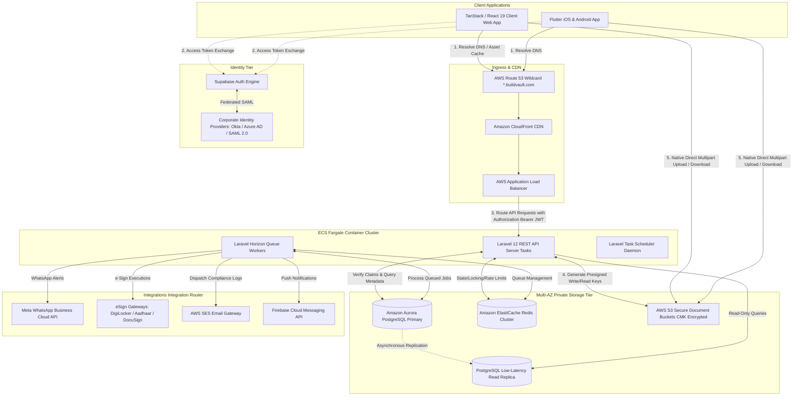
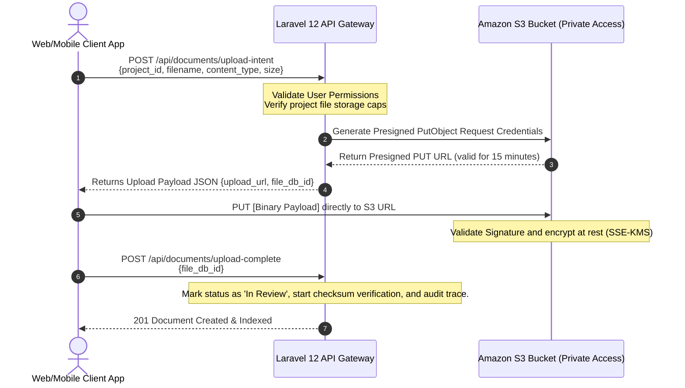
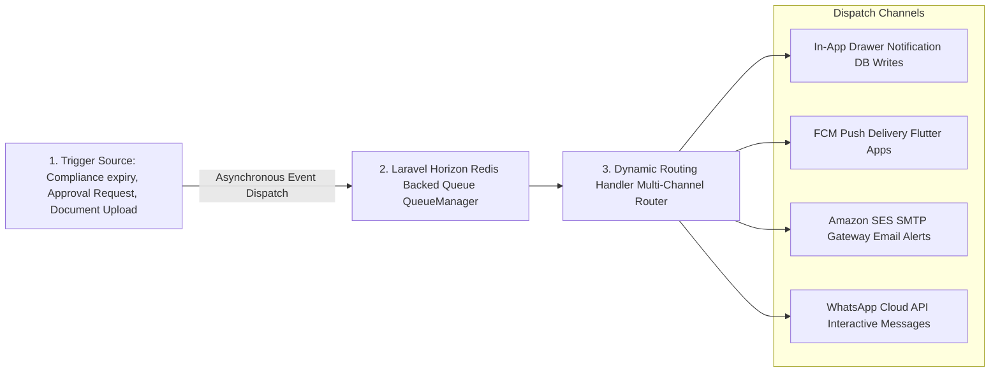

# BuildVault — Production-Grade SaaS Architecture & System Design

**Document ID:** BV-ARCH-02  
**Author:** Principal SaaS Architect  
**Date:** June 15, 2026  
**Status:** Approved for Core Engineering Implementation  
**Version:** 1.0.0  

---

This document designs the system architecture for **BuildVault**, a multi-tenant Document Management, Approvals, and Compliance platform optimized for Real Estate Developers and Construction Project Teams. It serves as the master blueprint for the database, application code, integration components, and deployment topologies.

---

## 1. High-Level Architecture Diagram

BuildVault utilizes a modern decoupled full-stack SaaS model. The system routes users via **AWS CloudFront** and an **AWS Application Load Balancer (ALB)** to a scalable containerized **Laravel 12 API Backend** hosted on **AWS ECS Fargate**, while user authentication is managed through **Supabase Auth**.



---

## 2. Multi-Tenant Architecture

BuildVault's multi-tenancy model relies on a **logical tenant separation strategy inside a shared database instance**, combined with database-enforced **Row Level Security (RLS)** and dynamic routing based on requested path metadata.

### 2.1 Storage Isolation Model
To maintain enterprise compliance without matching the cost overhead of a separate PostgreSQL server for every builder, BuildVault utilizes a single primary database instance containing isolated rows distinguished by an indexed UUID `organization_id`.

*   **Row-Level Security (RLS):** Every tenant schema definition model enforces an automatic global scope. Tenants can never access, modify, or inspect records corresponding to other corporations.
*   **Enterprise Hybrid Upgrades:** For premium, high-volume developers demanding physically isolated data zones, the infrastructure supports a separate "Target Server Node" connection. The database router middleware reads the client domain schema mapping and updates Laravel’s database execution context dynamically.

### 2.2 Subdomain Routing & Tenant Mapping
The entry criteria is dynamic based on incoming HTTP request headers:

1.  **Request Ingestion:** The client navigates to `https://abcbuilders.buildvault.com/api/v1/projects`.
2.  **Domain Parsing:** Laravel middleware inspects the hostname sub-segment:
```php
<?php

namespace App\Http\Middleware;

use Closure;
use App\Models\Organization;
use Illuminate\Http\Request;
use Symfony\Component\HttpFoundation\Response;

class ResolveTenantContext
{
    public function handle(Request $request, Closure $next): Response
    {
        $host = $request->getHost(); // e.g., "abcbuilders.buildvault.com"
        $subdomain = explode('.', $host)[0];

        // Ensure we isolate SaaS Admin or Core landing routes from corporate tenants
        if (in_array($subdomain, ['admin', 'www', 'app', 'localhost'])) {
            return $next($request);
        }

        $tenant = Organization::where('domain_subprefix', $subdomain)
            ->where('status', 'Active')
            ->first();

        if (!$tenant) {
            return response()->json(['error' => 'Organization partition not found or suspended.'], 403);
        }

        // Bind the active tenant into the Service Container for global dependency injection
        app()->instance(Organization::class, $tenant);

        return $next($request);
    }
}
```

### 2.3 Scoped Eloquent Queries (Database-Enforced Fallback)
Every table representing transactional data (e.g., `projects`, `documents`, `approvals`, `compliance_checklists`) contains an indexed `tenant_id` column. We use a Laravel generic trait `HasTenantScope` to automatically inject SQL constraints:

```php
<?php

namespace App\Traits;

use App\Models\Organization;
use Illuminate\Database\Eloquent\Builder;

trait HasTenantScope
{
    protected static function bootHasTenantScope(): void
    {
        static::creating(function ($model) {
            if (app()->bound(Organization::class)) {
                $model->tenant_id = app(Organization::class)->id;
            }
        });

        static::addGlobalScope('tenant_filter', function (Builder $builder) {
            if (app()->bound(Organization::class)) {
                $builder->where('tenant_id', '=', app(Organization::class)->id);
            }
        });
    }
}
```

---

## 3. Module Architecture

The backend codebase is split by Domain Boundaries (DDD), keeping individual services loosely coupled via Event Dispatches. This guarantees faster test runs, isolates computational failures, and supports future selective microservice decoupling.

```
app/Domains/
├── ProjectManagement/
│   ├── Models/               # Project (Planning, In Progress, On Hold, Completed)
│   ├── Controllers/
│   └── Services/             # Business rules for land parcel configurations
├── DocumentControl/
│   ├── Models/               # Document (Land, Legal, RERA, Construction, environmental, Finance...)
│   ├── Services/             # Multi-version S3 integrations & presigned URI gen
│   └── Listeners/            # Processes document metadata parsing on upload
├── ApprovalsEngine/
│   ├── Models/               # Approval Workflow, SignOffApprover, ThreadComment
│   └── Services/             # Sequential vs parallel sign-off state machines
├── ComplianceManager/
│   ├── Models/               # ComplianceChecklist, ExpiryMonitor
│   └── Commands/             # Expiry evaluator run by Cron hourly (creates notifications)
└── SaaSAdminConsole/
    ├── Models/               # Global audit log, Organisation tenant, Billing subscription
    └── Services/             # Tenant provisioning, lifecycle adjustments
```

Modules interface dynamically using Laravel’s embedded **Event Bus**:
*   *Event:* `DocumentUploadedEvent` is dispatched.
*   *Listeners:*
    *   `ComplianceManager` automatically marks associated project checklist indices complete.
    *   `ApprovalsEngine` creates a high-priority approval action if the drawing requires physical sign-off.
    *   `NotificationSystem` queues warning dispatches to Project Heads and Site Engineers.

---

## 4. Authentication & Authorization Flow

Identity access flows utilize a hybrid configuration between **Supabase Auth** (the system identity broker, which handles MFA, SSO, social federations, and password rules) and a **Laravel Role-Based Access Control (RBAC)** engine containing user profiles explicitly mapped in a separate `user_roles` database table.

```
[Flutter / React App]                                  [Supabase Auth Router]                        [Laravel 12 API Gateway]
          |                                                       |                                             |
          | ---- 1. Exchange Email/SSO Credentials -------------> |                                             |
          | <--- 2. Return Issued JSON Web Token (JWT) ---------- |                                             |
          |                                                       |                                             |
          | ---- 3. GET /projects [Header authorization: Bearer] ---------------------------------------------> |
          |                                                                                                     | ---- 4. Intercept request in Guard Middleware
          |                                                                                                     |      • Match JWT signature with public keys
          |                                                                                                     |      • Extract user meta & email claim
          |                                                                                                     |      • Match tenant_id & check user_roles table
          |                                                                                                     |      • Throw 401 if revoked/suspended
          |                                                                                                     | ---- 5. Activate Row Level Scope
          | <--- 6. Stream JSON Data Packets for Authorized Tenant Schema --------------------------------------|
```

### 4.1 JWT Verification Middleware
Laravel decodes and verifies the Supabase-issued RS256 token during every incoming request. Below is the custom middleware implementation:

```php
<?php

namespace App\Http\Middleware;

use Closure;
use Firebase\JWT\JWT;
use Firebase\JWT\Key;
use Illuminate\Http\Request;
use App\Models\User;
use App\Models\UserRole;

class AuthenticateSupabaseJWT
{
    private string $supabaseJwksUrl = "https://your-proj.supabase.co/rest/v1/auth/keys"; // Dynamic JWKS URI

    public function handle(Request $request, Closure $next)
    {
        $token = $request->bearerToken();
        if (!$token) {
            return response()->json(['error' => 'Authentication Bearer token is missing.'], 401);
        }

        try {
            // Retrieve Supabase Public Key to verify Token Signature
            $jwks = cache()->remember('supabase_jwks', 86450, function () {
                return json_decode(file_get_contents($this->supabaseJwksUrl), true);
            });

            // Decode the payload extracting user email and unique identifier
            $decoded = JWT::decode($token, new Key($jwks['keys'][0]['n'], 'RS256'));
            
            // Resolve User Profile internally in the tenant namespace
            $user = User::where('email', $decoded->email)->where('status', 'Active')->first();
            if (!$user) {
                return response()->json(['error' => 'Registered user record is inactive.'], 401);
            }

            // Expose the authenticated model during application lifecycle
            auth()->login($user);

        } catch (\Exception $e) {
            return response()->json(['error' => 'Signature verification failed: ' . $e->getMessage()], 401);
        }

        return $next($request);
    }
}
```

### 4.2 Strict RBAC Separation Roles (Stored in database)
Users map to exact privileges via an explicit database schema to eliminate profile bloat:

```sql
CREATE TABLE user_roles (
    id UUID PRIMARY KEY DEFAULT gen_random_uuid(),
    user_id UUID REFERENCES users(id) ON DELETE CASCADE,
    role VARCHAR(50) NOT NULL, -- 'Super Admin', 'Director', 'Project Manager', 'Site Engineer', 'Legal Team', 'Compliance Officer', 'Finance Team', 'Auditor'
    project_id UUID REFERENCES projects(id) NULL, -- Optional scope limitation
    created_at TIMESTAMP WITH TIME ZONE DEFAULT CURRENT_TIMESTAMP,
    CONSTRAINT unique_user_role_scope UNIQUE(user_id, role, project_id)
);
```

---

## 5. File Storage Architecture (AWS S3)

To store heavy project blueprints, Land records, building permits, and customer handover attachments securely, BuildVault isolates assets utilizing a single durable S3 storage bucket containing strict **Tenant Multi-Namespace Key Paths** protected by cryptographic server-side validation.

### 5.1 Storage Hierarchy Layout (Logical Isolation)
Documents uploaded to the main AWS bucket (`buildvault-prod-storage-bucket`) are structured under paths matching the target tenant and project contexts:

```
s3://buildvault-prod-storage-bucket/
└── {tenant_id}/
    └── {project_id}/
        └── {category_slug}/
            └── {document_id}/
                ├── v1_structure_drawing.pdf
                ├── v2_structure_drawing_revised.pdf [Object Versioning Tracker]
                └── audit_trail_signature_sha256.json
```

### 5.2 Secure Presigned URL Ingestion Sequence
Direct client uploads bypass the Laravel server compute limits using AWS S3 **presigned URLs**.



---

## 6. Notification Architecture

Real estate developers rely heavily on real-time task alerts to avert costly project blockages or compliance non-renewal fines.



### 6.1 Database Schema for Scoped Delivery
The system stores individual target notifications so clients can trace them across devices:

```sql
CREATE TABLE notifications (
    id UUID PRIMARY KEY DEFAULT gen_random_uuid(),
    tenant_id UUID NOT NULL REFERENCES organizations(id) ON DELETE CASCADE,
    user_id UUID NOT NULL REFERENCES users(id) ON DELETE CASCADE,
    title VARCHAR(255) NOT NULL,
    message TEXT NOT NULL,
    priority VARCHAR(10) DEFAULT 'Medium', -- 'High', 'Medium', 'Low'
    event_type VARCHAR(50) NOT NULL, -- 'pending_approval', 'compliance_near_expiry', 'document_modified'
    target_action_url VARCHAR(500) NULL, -- URL path mapping inside Web/Mobile App router
    is_read BOOLEAN NOT NULL DEFAULT FALSE,
    read_at TIMESTAMP WITH TIME ZONE NULL,
    created_at TIMESTAMP WITH TIME ZONE DEFAULT CURRENT_TIMESTAMP
);
CREATE INDEX idx_notif_unread_user ON notifications(user_id) WHERE is_read = FALSE;
```

---

## 7. Security Architecture

BuildVault's security profile operates on a zero-trust model across all software boundaries.

### 7.1 Database Level Guards (Postgres Row Level Security)
Postgres tables are protected using dynamic rules verifying the tenant context. Any malicious injection bypassing Laravel context checks is caught at the DB boundary:

```sql
-- Enable RLS on core documents table
ALTER TABLE documents ENABLE ROW LEVEL SECURITY;

-- Apply Tenant Isolation Policy dynamically matched to connection state session variables loaded on request
CREATE POLICY tenant_isolation_policy ON documents
    FOR ALL
    USING (tenant_id = NULLIF(current_setting('app.current_tenant_id', true), '')::UUID);
```

When Laravel resolves the active connection middleware during a client request, it injects the configuration:
```php
DB::statement("SET LOCAL app.current_tenant_id = '{$tenant->id}'");
```

### 7.2 Cryptographic Envelope Encryption
Sensitive credentials (such as integration API keys for Salesforce, DigiLocker Secrets, and SMTP auth tokens) are encrypted before writes and decrypted on the fly using Laravel's engine with `AES-256-GCM` key wrapping, backed by unique keys stored in HSM (Hardware Security Module).

### 7.3 Tamper-Proof Audit Logging
Any state manipulation triggers an immutable record stored in an append-only transaction ledger:

```sql
CREATE TABLE audit_logs (
    id UUID PRIMARY KEY DEFAULT gen_random_uuid(),
    tenant_id UUID NOT NULL REFERENCES organizations(id),
    user_id UUID NOT NULL,
    action VARCHAR(100) NOT NULL, -- 'Document_Deleted', 'Approval_Signed', 'Integration_Enabled'
    details TEXT NOT NULL,
    ip_address VARCHAR(45) NOT NULL,
    user_agent VARCHAR(255) NOT NULL,
    payload_hash VARCHAR(64) NOT NULL, -- SHA-256 hash chaining together previous record + payload 
    created_at TIMESTAMP WITH TIME ZONE DEFAULT CURRENT_TIMESTAMP
);
```

---

## 8. Deployment Architecture (AWS Cloud)

Deployments are designed for high availability (HA) and maximum security isolation, hosted in AWS across multiple Availability Zones.

```
AWS REGION [e.g., ap-south-1 Mumbai]
├── AWS ROUTE 53 (DNS Mapping & wildcard certificate routing)
└── VPC (Virtual Private Cloud) [10.0.0.0/16]
    ├── Public Subnets (AZ1 & AZ2) [10.0.1.0/24, 10.0.2.0/24]
    │   ├── AWS CloudFront CDN (Asset Deliveries & Edge Layer caching)
    │   ├── AWS Application Load Balancer (ALB) - TLS 1.3 Terminated
    │   └── NAT Gateways (Enables secure outbound connection for compute)
    │
    └── Private App Subnets (AWS ECS cluster in Fargate) [10.0.10.0/24, 10.0.20.0/24]
        ├── ECS Task: Laravel 12 API Container (Service Node) - Autoscaled
        ├── ECS Task: Horizon Queue Worker (Processing Engine)
        └── Security Group (Only accepts port 80/443 traffic routed from the ALB)
    │
    └── Isolated Database Subnets (Private multi-AZ) [10.0.100.0/24, 10.0.200.0/24]
        ├── Amazon Aurora Serverless v2 PostgreSQL (Multi-AZ replication)
        ├── Amazon ElastiCache Redis Cluster (Replicated Cluster Node)
        └── AWS S3 Protected Bucket Gateway Endpoint (Private Network Link)
```

---

## 9. Environment Strategy & CI/CD Pipeline

We split infrastructure management across three isolated environments matching clear development lifecycles:

1.  **Development (Local):** Run locally using Docker Compose, containing mock MinIO storage systems and Supabase CLI sandbox.
2.  **Staging (QA):** Automatically mirroring main branch changes into a dev-vpc, utilizing low-capacity serverless nodes for integration verification.
3.  **Production (Live):** High availability configurations with horizontal scaling triggers and strictly audited deploy keys.

### CI/CD Workflow (`.github/workflows/deploy-production.yml`)

The following automated pipeline builds the container, processes linting and tests, constructs production artifacts, pushes them to Amazon ECR, and orchestrates an ECS green-blue replacement deploy:

```yaml
name: Deploy BuildVault Production Service

on:
  push:
    branches: [ main ]

permissions:
  id-token: write
  contents: read

jobs:
  test-and-lint:
    runs-on: ubuntu-latest
    steps:
      - name: Checkout Code Repository
        uses: actions/checkout@v4

      - name: Setup PHP Environment
        uses: shivammathur/setup-php@v2
        with:
          php-version: '8.3'
          extensions: mbstring, dom, gd, pdo_pgsql

      - name: Install Project Dependencies
        run: composer install --no-interaction --prefer-dist --no-progress

      - name: Run Architecture Analysis & Linting
        run: ./vendor/bin/phpstan analyse --error-format=github

      - name: Fire Test Suite Execution
        run: php artisan test --parallel

  build-and-deploy:
    needs: test-and-lint
    runs-on: ubuntu-latest
    steps:
      - name: Checkout Code Repository
        uses: actions/checkout@v4

      - name: Configure AWS Credentials OIDC Authentication
        uses: aws-actions/configure-aws-credentials@v4
        with:
          role-to-assume: arn:aws:iam::800736498863:role/github-actions-ecs-deploy-role
          aws-region: ap-south-1

      - name: Log In to Amazon ECR
        id: login-ecr
        uses: aws-actions/amazon-ecr-login@v2

      - name: Build and Push Laravel Alpine Container
        env:
          ECR_REGISTRY: ${{ steps.login-ecr.outputs.registry }}
          ECR_REPOSITORY: buildvault-api-prod
          IMAGE_TAG: ${{ github.sha }}
        run: |
          docker build --target production -t $ECR_REGISTRY/$ECR_REPOSITORY:$IMAGE_TAG -t $ECR_REGISTRY/$ECR_REPOSITORY:latest .
          docker push --all-tags $ECR_REGISTRY/$ECR_REPOSITORY

      - name: Download Active Task Definition Schema
        run: |
          aws ecs describe-task-definition --task-definition buildvault-prod-api-task --query taskDefinition > task-definition.json

      - name: Compile Target Task with New Image Tag
        id: compile-task-def
        uses: aws-actions/amazon-ecs-render-task-definition@v1
        with:
          task-definition: task-definition.json
          container-name: buildvault-api-container
          image: ${{ steps.login-ecr.outputs.registry }}/buildvault-api-prod:${{ github.sha }}

      - name: Run ECS Fargate Rolling Update Deployment
        uses: aws-actions/amazon-ecs-deploy-task-definition@v2
        with:
          task-definition: ${{ steps.compile-task-def.outputs.task-definition }}
          service: buildvault-prod-api-service
          cluster: buildvault-prod-cluster
          wait-for-service-stability: true
```

---

## 10. Scalability & Operational Recommendations

To support millions of heavy architectural blueprints and concurrent sign-off workflows, the platform mandates strict scaling boundaries:

### 10.1 Multi-Read Database Replicas
Integrate low-latency Database read configuration blocks in Laravel's `config/database.php`:

```php
'pgsql' => [
    'read' => [
        'host' => [
            env('DB_REPLICA_1_HOST', 'pgsql-replica-1.buildvault.local'),
        ],
    ],
    'write' => [
        'host' => [
            env('DB_PRIMARY_HOST', 'pgsql-primary.buildvault.local'),
        ],
    ],
    'driver' => 'pgsql',
    'sticky' => true, // Ensure immediate reads on a record written during the same request use the primary node
    // ...
],
```

### 10.2 Cache Key Primitives (Redis Optimized Cache Layout)
*   **Permissions Matrix Caching:** User role structures inside `user_roles` are resolved and cached on login under key space prefixes: `tenant:{tenant_id}:user:{user_id}:roles`.
*   **Recent Activity Feed Caching:** Cache localized recent activity logs using Redis Sorted Sets (`ZSET`), allowing swift, sub-millisecond retrieval of the activity timeline.

### 10.3 Horizon Queue Workers & Rate Limiting
*   Heavy actions, such as calculating compliance expiration triggers and synchronizing third-party CRM records, are partitioned into isolated, auto-scaling Horizon worker queues.
*   Enforce strict API throttling to safeguard services against scraping over-utilization, utilizing Redis token buckets partitioned by `User_ID` / `Tenant_IP`.

### 10.4 Backup Strategies & Disaster Recovery
*   **Database PITR:** Point-In-Time-Recovery (PITR) enabled on Amazon Aurora, backing up transactional states up to any second in the past week (RPO of 5 seconds).
*   **S3 Cross-Region Replication:** Replicate S3 document stores asynchronously to an isolated AWS geographic region (e.g., from Mumbai `ap-south-1` to Singapore `ap-southeast-1`), protecting builder records against rare datacenter disasters.
