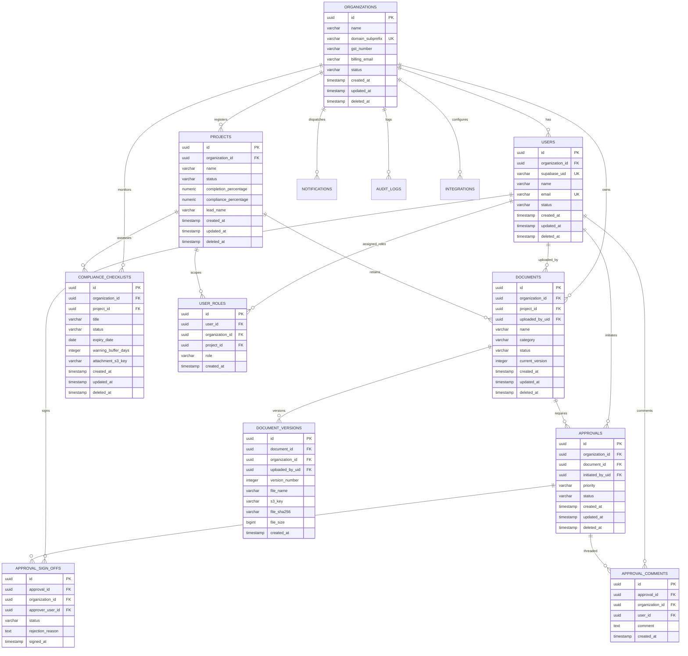

# BuildVault — Production-Grade PostgreSQL Database Schema Design

**Document ID:** BV-DB-03  
**Author:** Senior Database Architect  
**Date:** June 15, 2026  
**Status:** Approved for Core Engineering Implementation  
**Version:** 1.0.0  

---

This document designs a production-grade, highly optimized relational database schema for public or private cloud deployments of **BuildVault**. This schema implements a robust **Multi-Tenant** structure featuring complete row security, document versioning, role-based controls, compliance logs, and soft-delete capabilities.

---

## 1. Entity-Relationship Diagram (ERD)

The following Mermaid ER Diagram models the core entity layout, illustrating entity attributes, keys, and relational cardinality across modules.



---

## 2. Dynamic Database Migration Execution Order

Migrations must satisfy direct dependencies and foreign key constraints without throwing integrity validation conflicts. All files should execute in the exact order below:

1.  **System Extensions & Enums:** Register global uuid engines and specialized custom data enums.
2.  **`organizations` (Tenants Base):** The core root partition model. Everything scopes around this entity.
3.  **`users` (Identity Engine):** Houses enterprise representative identities referencing tenant scopes.
4.  **`user_roles` (RBAC Policies):** Standard role mapper binding roles, users, and projects.
5.  **`projects` (Workflow Boundary):** Project pipelines that house land records, tasks, and budgets.
6.  **`documents` (SaaS Document Manifests):** Holds index, state, metadata, and metadata hashes.
7.  **`document_versions` (Historical S3 Objects):** Houses file paths and encryption tags for multiple S3 version records linked to raw documents.
8.  **`approvals` (Sign-Off Orchestration Engine):** Captures high-level approval tasks linked to architectural artifacts.
9.  **`approval_sign_offs` (Individual Review Sign-Off Tracks):** Tracks individual reviewer assessments (Approved, Rejected, Requires Changes).
10. **`approval_comments` (Threaded Feedback Channels):** Captures comments, reasons, and conversations inside approval pipelines.
11. **`compliance_checklists` (Land, RERA, Structural Certifications):** Oversees permit validations, expiry notices, and certifications.
12. **`notifications` (Action items dispatch ledger):** Log records pushed to dynamic device sockets, FCM channels, or SMS hooks.
13. **`audit_logs` (Tamper-Proof System Ledgers):** Secure audit logs documenting administrative operations using SHA256 chain links.
14. **`integrations` (Unified API Connection Configurations):** Stores secure integration credentials (DigiLocker, eSign, WhatsApp).

---

## 3. High-Quality SQL Schema Script (PostgreSQL v16 Dialect)

This script is syntactically correct SQL optimized for high performance, utilizing strict data constraints, precise foreign key cascade indexes, and zero-downtime structural schemas.

```sql
-- ============================================================================
-- STEP 1: INITIAL STAGE - CONCURRENT SYSTEM EXTENSIONS & DATA ENUMS
-- ============================================================================

CREATE EXTENSION IF NOT EXISTS "uuid-ossp";
CREATE EXTENSION IF NOT EXISTS "pgcrypto";

-- System Custom Typologies (Enums)
CREATE TYPE tenant_status AS ENUM ('Active', 'Suspended', 'Pending_Verification');
CREATE TYPE user_status AS ENUM ('Active', 'Inactive', 'Invited');
CREATE TYPE project_status AS ENUM ('Planning', 'In_Progress', 'On_Hold', 'Completed');
CREATE TYPE document_status AS ENUM ('In_Review', 'Approved', 'Pending', 'Rejected');
CREATE TYPE approval_priority AS ENUM ('Low', 'Medium', 'High');
CREATE TYPE approval_status AS ENUM ('Pending', 'Approved', 'Requires_Changes', 'Rejected');
CREATE TYPE compliance_status AS ENUM ('Complete', 'Pending', 'Expiring', 'Missing');

-- ============================================================================
-- STEP 2: MULTI-TENANT PRIMARY BASE TIERS
-- ============================================================================

-- Table 1: Organizations (Tenant Master Partition Record)
CREATE TABLE organizations (
    id UUID PRIMARY KEY DEFAULT gen_random_uuid(),
    name VARCHAR(255) NOT NULL UNIQUE,
    domain_subprefix VARCHAR(63) NOT NULL UNIQUE,
    gst_number VARCHAR(15) NULL,
    billing_email VARCHAR(254) NOT NULL,
    status tenant_status NOT NULL DEFAULT 'Pending_Verification',
    created_at TIMESTAMP WITH TIME ZONE DEFAULT CURRENT_TIMESTAMP NOT NULL,
    updated_at TIMESTAMP WITH TIME ZONE DEFAULT CURRENT_TIMESTAMP NOT NULL,
    deleted_at TIMESTAMP WITH TIME ZONE NULL
);
CREATE INDEX idx_orgs_subdomain ON organizations(domain_subprefix) WHERE deleted_at IS NULL;

-- Table 2: Users (Corporate Identity Platform mapping)
CREATE TABLE users (
    id UUID PRIMARY KEY DEFAULT gen_random_uuid(),
    organization_id UUID NOT NULL REFERENCES organizations(id) ON DELETE CASCADE,
    supabase_uid UUID NOT NULL UNIQUE, -- Link to federated user identifier (supabase authentication)
    name VARCHAR(150) NOT NULL,
    email VARCHAR(254) NOT NULL,
    status user_status NOT NULL DEFAULT 'Invited',
    created_at TIMESTAMP WITH TIME ZONE DEFAULT CURRENT_TIMESTAMP NOT NULL,
    updated_at TIMESTAMP WITH TIME ZONE DEFAULT CURRENT_TIMESTAMP NOT NULL,
    deleted_at TIMESTAMP WITH TIME ZONE NULL,
    CONSTRAINT unique_tenant_email UNIQUE(organization_id, email)
);
CREATE INDEX idx_users_org_email ON users(organization_id, email) WHERE deleted_at IS NULL;
CREATE INDEX idx_users_supabase_uid ON users(supabase_uid);

-- ============================================================================
-- STEP 3: SYSTEMS DIRECTORIES & ENTERPRISE ROLES (RBAC)
-- ============================================================================

-- Table 3: Projects (Main Construction Pipeline)
CREATE TABLE projects (
    id UUID PRIMARY KEY DEFAULT gen_random_uuid(),
    organization_id UUID NOT NULL REFERENCES organizations(id) ON DELETE CASCADE,
    name VARCHAR(255) NOT NULL,
    status project_status NOT NULL DEFAULT 'Planning',
    completion_percentage NUMERIC(5, 2) NOT NULL DEFAULT 0.00 CONSTRAINT check_completion CHECK (completion_percentage BETWEEN 0.00 AND 100.00),
    compliance_percentage NUMERIC(5, 2) NOT NULL DEFAULT 0.00 CONSTRAINT check_compliance CHECK (compliance_percentage BETWEEN 0.00 AND 100.00),
    lead_name VARCHAR(150) NOT NULL,
    created_at TIMESTAMP WITH TIME ZONE DEFAULT CURRENT_TIMESTAMP NOT NULL,
    updated_at TIMESTAMP WITH TIME ZONE DEFAULT CURRENT_TIMESTAMP NOT NULL,
    deleted_at TIMESTAMP WITH TIME ZONE NULL
);
CREATE INDEX idx_projects_org ON projects(organization_id) WHERE deleted_at IS NULL;

-- Table 4: User Roles (Explicit Roles Mapped within Tenants and optionally scoped to specific Projects)
CREATE TABLE user_roles (
    id UUID PRIMARY KEY DEFAULT gen_random_uuid(),
    user_id UUID NOT NULL REFERENCES users(id) ON DELETE CASCADE,
    organization_id UUID NOT NULL REFERENCES organizations(id) ON DELETE CASCADE,
    project_id UUID NULL REFERENCES projects(id) ON DELETE CASCADE, -- Null means global organization-wide scope
    role VARCHAR(50) NOT NULL, -- e.g., 'Super Admin', 'Director', 'Project Manager', 'Site Engineer', 'Legal Team', 'Compliance Officer', 'Finance Team', 'Auditor'
    created_at TIMESTAMP WITH TIME ZONE DEFAULT CURRENT_TIMESTAMP NOT NULL,
    CONSTRAINT unique_user_role_project UNIQUE(user_id, role, project_id)
);
CREATE INDEX idx_roles_user_scope ON user_roles(user_id, organization_id);

-- ============================================================================
-- STEP 4: MODERN ROBUST DOCUMENT STORAGE & VERSIONING TIERS
-- ============================================================================

-- Table 5: Documents (Document Vault Manifest Index)
CREATE TABLE documents (
    id UUID PRIMARY KEY DEFAULT gen_random_uuid(),
    organization_id UUID NOT NULL REFERENCES organizations(id) ON DELETE CASCADE,
    project_id UUID NOT NULL REFERENCES projects(id) ON DELETE CASCADE,
    uploaded_by_uid UUID NOT NULL REFERENCES users(id) ON DELETE RESTRICT,
    name VARCHAR(255) NOT NULL,
    category VARCHAR(100) NOT NULL, -- e.g., 'Land Records', 'Legal', 'RERA', 'Construction', 'Environmental', 'Finance', 'Contracts', 'Sales', 'Customer Handover'
    status document_status NOT NULL DEFAULT 'In_Review',
    current_version INT NOT NULL DEFAULT 1 CONSTRAINT check_version CHECK (current_version > 0),
    created_at TIMESTAMP WITH TIME ZONE DEFAULT CURRENT_TIMESTAMP NOT NULL,
    updated_at TIMESTAMP WITH TIME ZONE DEFAULT CURRENT_TIMESTAMP NOT NULL,
    deleted_at TIMESTAMP WITH TIME ZONE NULL
);
CREATE INDEX idx_documents_composite ON documents(organization_id, project_id, category) WHERE deleted_at IS NULL;
CREATE INDEX idx_documents_status ON documents(organization_id, status) WHERE deleted_at IS NULL;

-- Table 6: Document Versions (S3 storage links corresponding to historical file increments)
CREATE TABLE document_versions (
    id UUID PRIMARY KEY DEFAULT gen_random_uuid(),
    document_id UUID NOT NULL REFERENCES documents(id) ON DELETE CASCADE,
    organization_id UUID NOT NULL REFERENCES organizations(id) ON DELETE CASCADE,
    uploaded_by_uid UUID NOT NULL REFERENCES users(id) ON DELETE RESTRICT,
    version_number INT NOT NULL CONSTRAINT check_ver_num CHECK (version_number > 0),
    file_name VARCHAR(255) NOT NULL,
    s3_key VARCHAR(1024) NOT NULL, -- Key index location inside target private AWS S3 Bucket
    file_sha256 VARCHAR(64) NOT NULL, -- Client SHA256 upload verification checksum
    file_size BIGINT NOT NULL CONSTRAINT check_file_size CHECK (file_size > 0), -- File size recorded in bytes
    created_at TIMESTAMP WITH TIME ZONE DEFAULT CURRENT_TIMESTAMP NOT NULL,
    CONSTRAINT unique_document_version UNIQUE(document_id, version_number)
);
CREATE INDEX idx_doc_versions_document ON document_versions(document_id);

-- ============================================================================
-- STEP 5: APPROVALS ORCHESTRATION PIPELINES
-- ============================================================================

-- Table 7: Approvals Pipeline (Main workflow state tracker)
CREATE TABLE approvals (
    id UUID PRIMARY KEY DEFAULT gen_random_uuid(),
    organization_id UUID NOT NULL REFERENCES organizations(id) ON DELETE CASCADE,
    document_id UUID NOT NULL REFERENCES documents(id) ON DELETE CASCADE,
    initiated_by_uid UUID NOT NULL REFERENCES users(id) ON DELETE RESTRICT,
    priority approval_priority NOT NULL DEFAULT 'Medium',
    status approval_status NOT NULL DEFAULT 'Pending',
    created_at TIMESTAMP WITH TIME ZONE DEFAULT CURRENT_TIMESTAMP NOT NULL,
    updated_at TIMESTAMP WITH TIME ZONE DEFAULT CURRENT_TIMESTAMP NOT NULL,
    deleted_at TIMESTAMP WITH TIME ZONE NULL
);
CREATE INDEX idx_approvals_org_status ON approvals(organization_id, status) WHERE deleted_at IS NULL;

-- Table 8: Approval Sign Offs (State trackers detailing reviewer decisions)
CREATE TABLE approval_sign_offs (
    id UUID PRIMARY KEY DEFAULT gen_random_uuid(),
    approval_id UUID NOT NULL REFERENCES approvals(id) ON DELETE CASCADE,
    organization_id UUID NOT NULL REFERENCES organizations(id) ON DELETE CASCADE,
    approver_user_id UUID NOT NULL REFERENCES users(id) ON DELETE RESTRICT,
    status approval_status NOT NULL DEFAULT 'Pending',
    rejection_reason TEXT NULL,
    signed_at TIMESTAMP WITH TIME ZONE NULL,
    CONSTRAINT unique_approval_user UNIQUE(approval_id, approver_user_id)
);
CREATE INDEX idx_sign_offs_approver ON approval_sign_offs(approver_user_id, status);

-- Table 9: Approval Comments (Feedback conversations attached to approval pipelines)
CREATE TABLE approval_comments (
    id UUID PRIMARY KEY DEFAULT gen_random_uuid(),
    approval_id UUID NOT NULL REFERENCES approvals(id) ON DELETE CASCADE,
    organization_id UUID NOT NULL REFERENCES organizations(id) ON DELETE CASCADE,
    user_id UUID NOT NULL REFERENCES users(id) ON DELETE CASCADE,
    comment TEXT NOT NULL,
    created_at TIMESTAMP WITH TIME ZONE DEFAULT CURRENT_TIMESTAMP NOT NULL
);
CREATE INDEX idx_comments_approval ON approval_comments(approval_id);

-- ============================================================================
-- STEP 6: COMPLIANCE, SYSTEMS INTEGRATION & COMMUNICATIONS
-- ============================================================================

-- Table 10: Compliance Checklists (RERA, NOCs, Building Permits trackers)
CREATE TABLE compliance_checklists (
    id UUID PRIMARY KEY DEFAULT gen_random_uuid(),
    organization_id UUID NOT NULL REFERENCES organizations(id) ON DELETE CASCADE,
    project_id UUID NOT NULL REFERENCES projects(id) ON DELETE CASCADE,
    title VARCHAR(255) NOT NULL,
    status compliance_status NOT NULL DEFAULT 'Pending',
    expiry_date DATE NOT NULL,
    warning_buffer_days INT NOT NULL DEFAULT 30 CONSTRAINT check_warning_buffer CHECK (warning_buffer_days >= 0),
    attachment_s3_key VARCHAR(1024) NULL, -- S3 file attachment proof (if complete)
    created_at TIMESTAMP WITH TIME ZONE DEFAULT CURRENT_TIMESTAMP NOT NULL,
    updated_at TIMESTAMP WITH TIME ZONE DEFAULT CURRENT_TIMESTAMP NOT NULL,
    deleted_at TIMESTAMP WITH TIME ZONE NULL,
    CONSTRAINT unique_project_compliance_item UNIQUE(project_id, title)
);
CREATE INDEX idx_compliance_tracker ON compliance_checklists(organization_id, expiry_date) WHERE deleted_at IS NULL;

-- Table 11: Notifications Ledger (Dispatch tracking indexes for push alerts)
CREATE TABLE notifications (
    id UUID PRIMARY KEY DEFAULT gen_random_uuid(),
    organization_id UUID NOT NULL REFERENCES organizations(id) ON DELETE CASCADE,
    user_id UUID NOT NULL REFERENCES users(id) ON DELETE CASCADE,
    title VARCHAR(255) NOT NULL,
    message TEXT NOT NULL,
    priority approval_priority NOT NULL DEFAULT 'Medium',
    event_type VARCHAR(100) NOT NULL, -- e.g., 'pending_approval', 'compliance_near_expiry', 'document_modified'
    target_action_url VARCHAR(500) NULL, -- In-app routing target navigation endpoint
    is_read BOOLEAN NOT NULL DEFAULT FALSE,
    read_at TIMESTAMP WITH TIME ZONE NULL,
    created_at TIMESTAMP WITH TIME ZONE DEFAULT CURRENT_TIMESTAMP NOT NULL
);
CREATE INDEX idx_notif_user_unread ON notifications(user_id) WHERE is_read = FALSE;

-- Table 12: Integrations (Tenant-scoped credentials storage)
CREATE TABLE integrations (
    id UUID PRIMARY KEY DEFAULT gen_random_uuid(),
    organization_id UUID NOT NULL REFERENCES organizations(id) ON DELETE CASCADE,
    service_provider VARCHAR(50) NOT NULL, -- e.g., 'DigiLocker', 'eSign', 'WhatsApp', 'Salesforce_CRM'
    is_active BOOLEAN NOT NULL DEFAULT TRUE,
    payload_credentials BYTEA NOT NULL, -- Secure wrapper (holds wrapped encrypted sensitive API Auth files)
    created_at TIMESTAMP WITH TIME ZONE DEFAULT CURRENT_TIMESTAMP NOT NULL,
    updated_at TIMESTAMP WITH TIME ZONE DEFAULT CURRENT_TIMESTAMP NOT NULL,
    CONSTRAINT unique_tenant_provider UNIQUE(organization_id, service_provider)
);
CREATE INDEX idx_integrations_tenant ON integrations(organization_id);

-- Table 13: Audit Trail Log Ledger (System-wide append-only ledger)
CREATE TABLE audit_logs (
    id UUID PRIMARY KEY DEFAULT gen_random_uuid(),
    organization_id UUID NOT NULL REFERENCES organizations(id) ON DELETE RESTRICT,
    user_id UUID NOT NULL, -- Intentionally decoupled from references constraint to allow retention if users delete records
    user_name VARCHAR(150) NOT NULL,
    user_role VARCHAR(50) NOT NULL,
    action VARCHAR(100) NOT NULL, -- e.g., 'Upload_Document', 'Sign_Approval', 'Archive_Project'
    details TEXT NOT NULL,
    ip_address VARCHAR(45) NOT NULL,
    user_agent VARCHAR(255) NOT NULL,
    previous_row_hash VARCHAR(64) NULL, -- SHA256 integrity blockchain hash chaining index ledger records together
    created_at TIMESTAMP WITH TIME ZONE DEFAULT CURRENT_TIMESTAMP NOT NULL
);
CREATE INDEX idx_audit_logs_tenant_action ON audit_logs(organization_id, action);

-- ============================================================================
-- STEP 7: TRIGGER AUTOMATIONS FOR AUTOMATIC METRIC RECALCULATIONS
-- ============================================================================

-- Core function: Automated update of update timestamps across all indices on write update
CREATE OR REPLACE FUNCTION trigger_update_timestamp()
RETURNS TRIGGER AS $$
BEGIN
    NEW.updated_at = CURRENT_TIMESTAMP;
    RETURN NEW;
END;
$$ LANGUAGE plpgsql;

-- Apply triggers to core timestamp tracking entities
CREATE TRIGGER trg_update_orgs BEFORE UPDATE ON organizations FOR EACH ROW EXECUTE FUNCTION trigger_update_timestamp();
CREATE TRIGGER trg_update_users BEFORE UPDATE ON users FOR EACH ROW EXECUTE FUNCTION trigger_update_timestamp();
CREATE TRIGGER trg_update_projects BEFORE UPDATE ON projects FOR EACH ROW EXECUTE FUNCTION trigger_update_timestamp();
CREATE TRIGGER trg_update_documents BEFORE UPDATE ON documents FOR EACH ROW EXECUTE FUNCTION trigger_update_timestamp();
CREATE TRIGGER trg_update_approvals BEFORE UPDATE ON approvals FOR EACH ROW EXECUTE FUNCTION trigger_update_timestamp();
CREATE TRIGGER trg_update_compliance BEFORE UPDATE ON compliance_checklists FOR EACH ROW EXECUTE FUNCTION trigger_update_timestamp();
CREATE TRIGGER trg_update_integrations BEFORE UPDATE ON integrations FOR EACH ROW EXECUTE FUNCTION trigger_update_timestamp();
```

---

## 4. Multi-Tenant Optimization & Sharding Guidelines

To efficiently scale BuildVault across millions of client data actions, follow these structural design standards:

*   **Row-Level Security (RLS) Policies:** Let database access control engines monitor transaction safety barriers locally within PostgreSQL, bypassing slow external application-layer checking sweeps.
*   **Logical Tenant Separation (Primary Scope):** The composite indices built on table structures pairing `organization_id` with entity properties (e.g., `idx_documents_composite` mapping `organization_id`, `project_id`, and `category`) enable rapid data fetches across multi-tenant files.
*   **Horizontal Tenant Partitioning (Scale Out):**
    For ultra-large real estate enterprises demanding dedicated computational performance, transition to **AWS Aurora PostgreSQL Database Sharding/Partitioning**. By partitioning tables `BY HASH (organization_id)`, AWS Aurora automatically places active corporate tenant logs inside separate hardware nodes seamlessly, scaling I/O limits exponentially.

---

## 5. Standard Soft Delete Engine Patterns

Using soft-delete indexes avoids accidental document loss while preserving structural references inside historical audit logs.

```sql
-- Create an active document view ignoring archived documents
CREATE OR REPLACE VIEW active_documents AS
SELECT * 
FROM documents 
WHERE deleted_at IS NULL;

-- Automated Soft-Delete Rule Example
CREATE OR REPLACE RULE soft_delete_document AS
ON DELETE TO documents
DO INSTEAD (
    UPDATE documents 
    SET deleted_at = CURRENT_TIMESTAMP, 
        status = 'Rejected' -- Mark archived items clearly
    WHERE id = OLD.id
);
```
