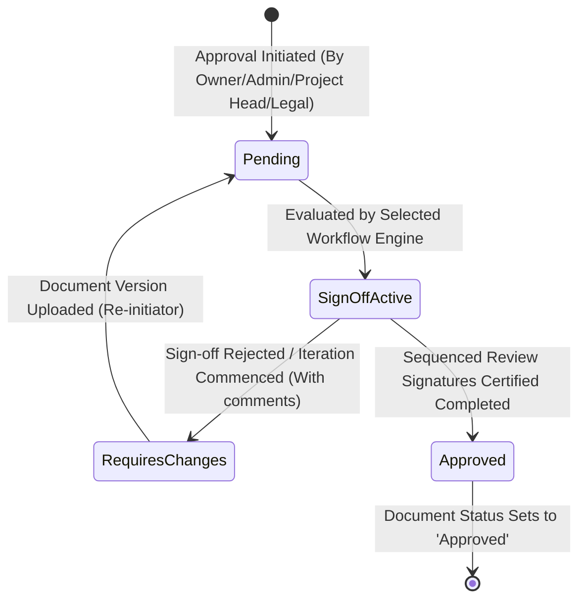

# BuildVault — Robust RBAC Permissions Matrix & Security Architecture

**Document ID:** BV-SEC-04  
**Author:** SaaS Security Architect  
**Date:** June 15, 2026  
**Status:** Approved for Implementation  
**Version:** 1.0.0  

---

This document designs the global **Role-Based Access Control (RBAC)** model for the BuildVault platform. It establishes the granular access privileges, CRUD authorizations, and security boundaries separating tenants, project workspaces, mobile field scanners, and administrative overrides.

---

## 1. Core Security & Authorization Design Principles

BuildVault enforces a **Zero-Trust & Least-Privilege Authorization Model** across all user roles. Access boundaries adhere to three critical design constraints:

1.  **Strict Multi-Tenancy Boundary:** Tenant isolation takes absolute precedence. No user, regardless of scope or role, can traverse, query, inspect, or modify records belonging to other organizations.
2.  **Least-Privilege Principal (POLP):** Users are granted only the minimum access level necessary to fulfill their respective operational workflows (e.g., a Site Engineer cannot inspect corporate billing, and an Auditor cannot approve budget revisions).
3.  **Project-Scoped Contexts:** Roles can be scoped universally (tenant-wide) or dynamically bound to an individual project footprint (project-scoped), as documented in the database schema (`user_roles.project_id`).

---

## 2. Definitive Role Classifications

BuildVault’s security environment maps all enterprise representatives into seven primary security roles:

*   **Owner (Sponsor/Promoter):** The corporate representative under whom the tenant workspace is provisioned. Holds full universal CRUD rights over billing, configurations, organization branding, integrations, and user lifecycle events.
*   **Admin (Operations Lead/SaaS Owner):** Enterprise operations manager. Holds universal edit and management permissions except for tenant deletion, billing alterations, or root integration adjustments.
*   **Project Head (GM / PM / Project Director):** Runs a localized project end-to-end. Holds full management privileges scoped solely to their assigned projects (e.g., managing project documents, initiating approval workflows, and verifying compliance checklists).
*   **Site Engineer (Field Representative):** Deployed physically on-site. Workflows center around mobile devices. Privileges permit document uploads (blueprints, site photos, daily logs) and checklist view checks, but restrict document deletion, compliance adjustments, or final approvals.
*   **Legal / Liaison (Compliance Officer):** The regulatory manager. Manages compliance trackers, RERA certifications, municipal approvals, and environmental clearances. Holds view-only document access except for legal, environmental, and permit attachments.
*   **Finance Controller:** Oversees cashflows, contracts, vendor accounts, and purchase orders. Scoped to read-write documents on contracts, taxes, env records, budgets, and invoices.
*   **Viewer (Auditor / External Consultant):** Scoped read-only representative. Excluded from all write, edit, delete, comment, upload, or sign-off operations.

---

## 3. Comprehensive Global CRUD Access Matrix

The following table outlines the absolute authorization mapping for core system resources:

| System Resource | Privilege Scope | Owner | Admin | Project Head | Site Engineer | Legal Team | Finance Team | Viewer / Auditor |
| :--- | :--- | :---: | :---: | :---: | :---: | :---: | :---: | :---: |
| **Organization Accounts & Billing** | CRUD | **ALL** | Read | Read | None | None | None | None |
| **Tenant Settings & SSO Configuration** | CRUD | **ALL** | Read | None | None | None | None | None |
| **API Integration Connections (S3, eSign)** | CRUD | **ALL** | Read | None | None | None | None | None |
| **Project Creation / Deactivation** | CRUD | **ALL** | **ALL** | None | None | None | None | None |
| **User Onboarding / Lifecycle & Roles** | CRUD | **ALL** | **ALL** | Read (Project Only) | None | None | None | None |
| **Audit Log Exports (Leger Logs)** | CRUD | **ALL** | Read | Read (Project Only) | None | Read | Read | Read |
| **Document Vault Index List/Search** | Read | **ALL** | **ALL** | **ALL** | **ALL** | **ALL** | **ALL** | **ALL** |
| **Document Uploads & Direct S3 PUTs** | Create | **ALL** | **ALL** | **ALL** | **ALL** | **ALL** | **ALL** | None |
| **Document Deletion / Archive** | Delete | **ALL** | **ALL** | **ALL** (Self Uploads Only) | None | None | None | None |
| **Trigger Approval Workflows** | Create | **ALL** | **ALL** | **ALL** | None | **ALL** | **ALL** | None |
| **Execute Final Sign-Off (Approver)** | Update | **ALL** | **ALL** | **ALL** | None | **ALL** (Legal Only) | **ALL** (Finance Only) | None |
| **Compliance Checklist Registrations** | Create/Update | **ALL** | **ALL** | **ALL** | None | **ALL** | None | None |

---

## 4. Module Boundary Permissions Specifications

### 4.1 Project Pipeline Permissions
*   **Owner / Admin:** Universal project control (create, archive, edit names, configure default checklists).
*   **Project Head:** Allowed to update their designated project metadata fields (e.g., update completion percentage, adjust project team mapping).
*   **Site Engineer / Legal / Finance / Viewer:** Strict read-only project summary metadata access.

### 4.2 Document Vault & Versioning Boundaries
*   **Security Principle (File Category Separation):** Multi-tenant S3 files belong to specific categories. Access rules intercept operations based on document type tags:
    *   *Contracts & Finance Categories:* Read-Write access restricted explicitly to **Owner**, **Admin**, and **Finance Team**. Blocked for **Site Engineer** and **Legal Team**.
    *   *RERA, Land Records & Permits Categories:* Read-Write access restricted to **Owner**, **Admin**, **Project Head**, and **Legal Team**. Blocked for **Finance Team**.
    *   *Blueprints & Construction Photos:* Read-Write access granted to **Owner**, **Admin**, **Project Head**, and **Site Engineer**.
*   **Immutability Strategy:** Retaining absolute document integrity means no role, including the Owner, can modify or overwrite an existing document version file on S3. Any adjustment defaults to establishing a subsequent incremental S3 record (`document_versions.version_number += 1`).

### 4.3 Approvals Engine Sequence Controls
BuildVault approvals function as strict hierarchical sequentially state structures:



*   **Approval Creators:** **Owner**, **Admin**, **Project Head**, **Legal**, **Finance**.
*   **Approver Assignments (Sign-Off):** Scoped exclusively based on role context matched to approval tags (e.g., a Finance approval requires explicit signature from a user designated with the `Finance Team` role). Site Engineers and generic Viewers are blocked from executing sign-offs.

### 4.4 Mobile Field Scanner Permissions (Site Engineer Optimization)
Works on-site inside the Flutter native environment demand tight offline caches and fast uploads:
*   **Optimized Actions:** Site Engineers are authorized solely to execute:
    *   Direct-upload document attachment (taking site photos, selecting local engineering blueprint PDFs).
    *   Read project summary feeds and workspace notices.
    *   View active compliance alerts on site-specific permits (e.g., Labor License warning tracker).
*   **Blocked Actions:** Mobile sessions associated with Site Engineers are barred from altering database checklists, configuring integrations, deleting documents, or signing off budget variations.

---

## 5. Global SaaS Super Admin Isolation

To handle multi-tenant administrative setups without compromising tenant isolation, BuildVault separates global SaaS Operators from corporate client environments:

*   **SaaS Admin (Super Admin):** High-level global operator who manages the platform's infrastructure.
    *   *Capabilities:* Provisioning new client organizations, regulating tenant subscription states (Active, Inactive, Suspended), troubleshooting infrastructure platforms, and monitoring core system health metrics.
    *   *Isolation Limit:* Cannot query, inspect, browse, download, or edit any transactional data elements (such as land documents, approval commentaries, or legal clearances) inside individual tenant workspaces. This separation prevents structural data leaks and guarantees complete compliance and data privacy.

---

## 6. Implementation Guard: Middleware Role Checks

Role safety is validated on the backend during every API transaction. Below is the Laravel authorization middleware checking roles and project contexts:

```php
<?php

namespace App\Http\Middleware;

use Closure;
use Illuminate\Http\Request;
use Symfony\Component\HttpFoundation\Response;
use App\Models\UserRole;

class RequireWorkspaceRole
{
    /**
     * Handle an incoming request.
     *
     * @param  \Illuminate\Http\Request  $request
     * @param  \Closure  $next
     * @param  string  $allowedRoles Comma-separated lists of acceptable roles (e.g., "Owner,Admin")
     * @return \Symfony\Component\HttpFoundation\Response
     */
    public function handle(Request $request, Closure $next, string $allowedRoles): Response
    {
        $user = auth()->user();
        if (!$user) {
            return response()->json(['error' => 'Unauthenticated connection attempt.'], 401);
        }

        $rolesArray = explode('|', $allowedRoles);
        
        // Extract incoming project scope parameter from request context
        $projectId = $request->route('project_id') ?? $request->input('project_id');

        // Resolve active user permissions mapped within the database
        $hasValidRole = UserRole::where('user_id', $user->id) 
            ->where('organization_id', $user->organization_id)
            ->where(function ($query) use ($rolesArray, $projectId) {
                $query->whereIn('role', $rolesArray)
                      ->where(function ($subQuery) use ($projectId) {
                          $subQuery->whereNull('project_id') // Universal tenant scope
                                   ->orWhere('project_id', '=', $projectId); // Localized project scope
                      });
            })
            ->exists();

        if (!$hasValidRole) {
            return response()->json([
                'error' => 'Access Denied: Your assigned platform security scope is insufficient to execute this transaction.'
            ], 403);
        }

        return $next($request);
    }
}
```

This middleware is applied inside HTTP routing files to protect sensitive endpoints:
```php
Route::delete('/api/projects/{project_id}/documents/{document_id}', [DocumentController::class, 'destroy'])
    ->middleware('role:Owner|Admin|ProjectHead');
```
