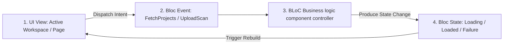

# BuildVault — Enterprise Flutter Mobile App Architecture & Design

**Document ID:** BV-MOB-07  
**Author:** Principal Flutter Enterprise Architect  
**Date:** June 15, 2026  
**Status:** Approved for Core Mobile Engineering  
**Version:** 1.0.0  

---

This document designs the frontend architecture, performance pipelines, state managers, scanning nodes, and offline-first workflows of the **BuildVault** iOS/Android application. Field representatives, site engineers, and executive approvers utilize this codebase to track real-time compliance steps, view blueprints, scan permits, and execute sign-offs directly from construction sites.

---

## 1. Directory Structure: Feature-First Domain Design

BuildVault uses a **Feature-Driven Modular Directory Structure**. Features are partitioned explicitly, housing self-contained representation, data models, domain business rules, and UI blocks. This guarantees isolation, prevents merge congestion across teams, and supports selective hot-reload configurations.

```
lib/
├── core/                                # Shared Core Layer
│   ├── api/                             # Network clients, Dio wrappers, interceptors
│   ├── database/                        # Isar Local Database schemas, adapters
│   ├── errors/                          # Failure models, boundary handlers
│   ├── theme/                           # Color tokens, styles, typographic scaling
│   └── utils/                           # Helpers, image compressors, string manipulation
├── features/                            # Feature Modules
│   ├── auth/                            # Authentication module
│   │   ├── data/                        # Repositories & Supabase Auth bindings
│   │   ├── domain/                      # Models (User, Org, Credentials)
│   │   └── presentation/                # Pages (Login, MFA, Reset Password)
│   ├── dashboard/                       # Corporate Summary & KPI Metrics
│   │   ├── presentation/                # Pages, dashboard charts, progress ring views
│   │   └── state/                       # Dashboard state managers (Riverpod/BLoC)
│   ├── projects/                        # Projects directory pipeline
│   ├── scanner/                         # Camera node, edge detection, PDF compiler
│   │   ├── data/                        # Local image processing wrappers
│   │   ├── domain/                      # Document Perspective Correction workflows
│   │   └── presentation/                # Camera views, cropping previews
│   └── uploader/                        # Direct S3 multi-part background uploader
│       ├── data/                        # Background synchronization queues
│       └── state/                       # Upload progression trackers
└── main.dart                            # Global execution entry, global bindings override
```

---

## 2. Shared Tech Stack & Packages

The production mobile client operates on **Flutter 3.x** and relies on high-performance packages:

*   **State Management:** `flutter_bloc` (v8.1+) - Ensures strict unidirectional data flow, simple trace states, and immutable state changes.
*   **Declarative Routing:** `go_router` (v14.0+) - Facilitates deep-linking, target-action URL routing, and security guard checks.
*   **Networking Client:** `dio` (v5.0+) - Provides custom interceptors, direct S3 multi-part stream progress tracking, and file cancellation tokens.
*   **Offline Data Store:** `isar` (v3.0+) - High-performance ACID-compliant embedded local database, replacing slow SQLite wrappers.
*   **Secure Cache Storage:** `flutter_secure_storage` - Encrypted sector storage for OAuth access keys and JWT payloads.
*   **Camera & Image Processing:** `camera`, `image_picker`, `edge_detection` - Native camera controls and perspective cropping filters.

---

## 3. High-Performance State Management Pattern (BLoC)

We use **BLoC (Business Logic Component)** to separate presentation components from background calculations. The state cycle works under strict unidirectional patterns:



### 3.1 Document Selection BLoC Implementation
The class pattern below monitors target architectural drawings or land permit listings:

```dart
// features/documents/presentation/state/document_bloc.dart
import 'package:flutter_bloc/flutter_bloc.dart';
import 'package:equatable/equatable.dart';
import 'package:buildvault/features/documents/domain/models/document.dart';
import 'package:buildvault/features/documents/domain/repositories/document_repository.dart';

// 1. Events
abstract class DocumentEvent extends Equatable {
  const DocumentEvent();
  @override
  List<Object?> get props => [];
}

class FetchDocuments extends DocumentEvent {
  final String projectId;
  final String? category;
  const FetchDocuments({required this.projectId, this.category});

  @override
  List<Object?> get props => [projectId, category];
}

// 2. States
abstract class DocumentState extends Equatable {
  const DocumentState();
  @override
  List<Object?> get props => [];
}

class DocumentInitial extends DocumentState {}
class DocumentLoading extends DocumentState {}
class DocumentLoaded extends DocumentState {
  final List<Document> documents;
  const DocumentLoaded(this.documents);

  @override
  List<Object?> get props => [documents];
}
class DocumentError extends DocumentState {
  final String message;
  const DocumentError(this.message);

  @override
  List<Object?> get props => [message];
}

// 3. BLoC Controller
class DocumentBloc extends Bloc<DocumentEvent, DocumentState> {
  final DocumentRepository _repository;

  DocumentBloc(this._repository) : super(DocumentInitial()) {
    on<FetchDocuments>((event, emit) async {
      emit(DocumentLoading());
      try {
        final docs = await _repository.getDocuments(
          projectId: event.projectId, 
          category: event.category
        );
        emit(DocumentLoaded(docs));
      } catch (e) {
        emit(DocumentError("Failed to fetch documents: ${e.toString()}"));
      }
    });
  }
}
```

---

## 4. API Client Layer with Dio Interceptors

The networking model relies on **Dio** configured with specialized interceptors to inject tenant contexts, authorize queries, rate-limit, and refresh expired sessions.

```dart
// core/api/api_client.dart
import 'package:dio/dio.dart';
import 'package:flutter_secure_storage/flutter_secure_storage.dart';

class ApiClient {
  final Dio dio;
  final FlutterSecureStorage _storage = const FlutterSecureStorage();

  ApiClient({required String baseDomain}) : dio = Dio() {
    dio.options.baseUrl = "https://$baseDomain/api/v1";
    dio.options.connectTimeout = const Duration(seconds: 15);
    dio.options.receiveTimeout = const Duration(seconds: 15);

    dio.interceptors.add(
      InterceptorsWrapper(
        onRequest: (options, handler) async {
          // 1. Safely resolve local Supabase JWT Token from Secure Storage
          final token = await _storage.read(key: 'supabase_jwt');
          if (token != null) {
            options.headers['Authorization'] = 'Bearer $token';
          }
          
          options.headers['Accept'] = 'application/json';
          return handler.next(options);
        },
        onError: (DioException e, handler) async {
          // 2. Handle JWT expiration cases with automatic retry validation
          if (e.response?.statusCode == 401) {
            final refreshed = await _refreshSupabaseSession();
            if (refreshed) {
              // Retry initial failed request with the newly issued access key
              final options = e.requestOptions;
              final newToken = await _storage.read(key: 'supabase_jwt');
              options.headers['Authorization'] = 'Bearer $newToken';
              final response = await dio.fetch(options);
              return handler.resolve(response);
            }
          }
          return handler.next(e);
        },
      ),
    );
  }

  Future<bool> _refreshSupabaseSession() async {
    // Session refresh logic interacting natively with local Supabase Auth Client
    // Updates secure storage and returns true upon success
    return true; 
  }
}
```

---

## 5. Declarative Routing & Deep-Linking Scheme

Dynamic navigation targets are registered using **GoRouter**, checking RBAC contexts securely before executing screen transits.

```dart
// core/navigation/app_router.dart
import 'package:go_router/go_router.dart';
import 'package:flutter/material.dart';
import 'package:buildvault/features/auth/presentation/login_page.dart';
import 'package:buildvault/features/dashboard/presentation/dashboard_page.dart';
import 'package:buildvault/features/scanner/presentation/scanner_page.dart';

class AppRouter {
  final bool isUserAuthenticated;

  AppRouter({required this.isUserAuthenticated});

  late final GoRouter router = GoRouter(
    initialLocation: isUserAuthenticated ? '/dashboard' : '/login',
    routes: [
      GoRoute(
        path: '/login',
        builder: (context, state) => const LoginPage(),
      ),
      GoRoute(
        path: '/dashboard',
        builder: (context, state) => const DashboardPage(),
      ),
      GoRoute(
        path: '/scanner',
        builder: (context, state) => const ScannerPage(), // Dedicated Native Scanning Mode
      ),
    ],
    redirect: (context, state) {
      final loggedIn = isUserAuthenticated;
      final loggingIn = state.matchedLocation == '/login';

      if (!loggedIn && !loggingIn) return '/login';
      if (loggedIn && loggingIn) return '/dashboard';
      
      return null;
    },
  );
}
```

---

## 6. Offline Caching Strategy (Isar Embedded Database)

Site Engineers frequently operate in remote locations or basement areas with poor internet connection. BuildVault implements a highly optimized **offline-first capability**:

*   **Strategy:** Users read and update records directly on a local **Isar database** node. Write operations target a local transaction log queue.
*   **Asynchronous Sync:** When network connectivity is restored, background jobs synchronize local transactions with the cloud sequentially.

```dart
// core/database/offline_sync_manager.dart
import 'package:isar/isar.dart';
import 'package:connectivity_plus/connectivity_plus.dart';

@collection
class SyncQueueItem {
  Id id = Isar.autoIncrement;
  late String endpoint; // e.g., "/api/v1/projects/"
  late String method;   // e.g., "POST"
  late String jsonPayload;
  late DateTime timestamp;
}

class OfflineSyncManager {
  final Isar isar;
  final Connectivity _connectivity = Connectivity();

  OfflineSyncManager(this.isar) {
    // Register structural listener track for network re-connection
    _connectivity.onConnectivityChanged.listen((ConnectivityResult result) {
      if (result != ConnectivityResult.none) {
        _triggerOutboxSync();
      }
    });
  }

  Future<void> addToQueue(String endpoint, String method, String payload) async {
    final item = SyncQueueItem()
      ..endpoint = endpoint
      ..method = method
      ..jsonPayload = payload
      ..timestamp = DateTime.now();

    await isar.writeTxn(() async {
      await isar.syncQueueItems.put(item);
    });
  }

  Future<void> _triggerOutboxSync() async {
    final pendingItems = await isar.syncQueueItems.where().sortByTimestamp().findAll();
    if (pendingItems.isEmpty) return;

    for (var item in pendingItems) {
      try {
        final success = await _dispatchPayload(item);
        if (success) {
          // Remove from local sync outbox upon successful cloud write to free resources
          await isar.writeTxn(() async {
            await isar.syncQueueItems.delete(item.id);
          });
        }
      } catch (e) {
        // Halt synchronization sequence if a structural server error is caught (retried later)
        break;
      }
    }
  }

  Future<bool> _dispatchPayload(SyncQueueItem item) async {
    // Dynamic network POST request to server returning true upon completion
    return true;
  }
}
```

---

## 7. Push Notification Architecture (FCM Integration)

Real-time notifications leverage **Firebase Cloud Messaging (FCM)**. Device tokens are updated dynamically in the database upon user authentication.

```dart
// core/notifications/notification_service.dart
import 'package:firebase_messaging/firebase_messaging.dart';
import 'package:flutter_local_notifications/flutter_local_notifications.dart';

class NotificationService {
  final FirebaseMessaging _fcm = FirebaseMessaging.instance;
  final FlutterLocalNotificationsPlugin _localNotifications = FlutterLocalNotificationsPlugin();

  Future<void> initialize() async {
    // 1. Request OS level permissions
    await _fcm.requestPermission(
      alert: true,
      badge: true,
      provisional: false,
      sound: true,
    );

    // 2. Fetch unique FCM device token and register it on our backend
    String? token = await _fcm.getToken();
    if (token != null) {
      await _registerTokenOnBackend(token);
    }

    // 3. Configure in-app notification pathways
    FirebaseMessaging.onMessage.listen((RemoteMessage message) {
      _showLocalNotification(message);
    });
  }

  void _showLocalNotification(RemoteMessage message) {
    const AndroidNotificationDetails androidDetails = AndroidNotificationDetails(
      'buildvault_urgent_channel',
      'Urgent Document Approvals & Compliance Alerts',
      importance: Importance.max,
      priority: Priority.high,
    );
    const NotificationDetails platformDetails = NotificationDetails(android: androidDetails);
    
    _localNotifications.show(
      0, 
      message.notification?.title ?? '', 
      message.notification?.body ?? '', 
      platformDetails
    );
  }

  Future<void> _registerTokenOnBackend(String token) async {
    // REST API POST targetting '/users/register-device-token'
  }
}
```

---

## 8. Scanner Module Architecture

Custom engineering plans, municipal NOC slips, and building permits must be digitized accurately. BuiltVault integrates a low-level native scanning module designed as a self-contained feature layout:

```
[Camera Feed Initialization] 
          │
          ▼
[Continuous Real-Time Image Stream Analysis]
          │ (Hough Transform perspective boundary check)
          ▼
[Auto-Capture Trigger on Edge Stabilized]
          │ (Crops along parsed quad constraints)
          ▼
[Isolate and Compress Image File] (Bilinear Filter scaling, Gray-scale / B&W Filter normalization)
          │
          ▼
[Compile Document Version Payload] (Saves as compressed local PDF file)
```

1.  **Perspective Boundary Detection:** Performs high-speed Hough Transform Calculations to discover quad edges.
2.  **Edge Corrected Rectification:** Rectifies skew and normalizes the matrix using bilinear interpolation.
3.  **Visual Cleanup Filters:** Converts the crop into a crisp Black-and-White high-contrast image (300 DPI target format) to maximize text legibility.
4.  **Local Assembly Wrapper:** Compiles the scanned images into a compressed, single of multi-page PDF output file.

---

## 9. Secure Client Direct-to-S3 Multi-Part Upload

Heavy scanned blueprints are uploaded directly from iOS/Android devices to S3 using multi-part stream blocks, avoiding backend proxy overhead.

```dart
// features/uploader/data/s3_uploader.dart
import 'dart:io';
import 'package:dio/dio.dart';

class S3DirectUploder {
  final Dio _dio = Dio();

  /**
   * Upload binary file directly to presigned cloud S3 key.
   */
  Future<void> uploadFileDirectToS3({
    required File file,
    required String s3PresignedPutUrl,
    required Function(int sent, int total) onProgress,
  }) async {
    final fileLength = await file.length();
    
    final Response response = await _dio.put(
      s3PresignedPutUrl,
      data: file.openRead(),
      options: Options(
        headers: {
          'Content-Length': fileLength,
          'Content-Type': 'application/octet-stream',
        },
      ),
      onSendProgress: (sent, total) {
        onProgress(sent, fileLength);
      },
    );

    if (response.statusCode != 200) {
      throw Exception("Direct S3 upload failed; Server responded with: ${response.statusCode}");
    }
  }
}
```

---

## 10. Centralized Error Isolation & Sentry Logs

Global error boundaries protect mobile applications against crashing. Run unhandled exceptions dynamically directly through **Sentry** hooks:

```dart
// core/errors/app_error_handler.dart
import 'package:flutter/foundation.dart';
import 'package:sentry_flutter/sentry_flutter.dart';

class AppErrorHandler {
  static void registerErrorHandler() {
    // 1. Intercept standard Framework render errors
    FlutterError.onError = (FlutterErrorDetails details) {
      FlutterError.presentError(details);
      Sentry.captureException(details.exception, stackTrace: details.stack);
    };

    // 2. Intercept asynchronous Dart run thread exceptions
    PlatformDispatcher.instance.onError = (error, stack) {
      Sentry.captureException(error, stackTrace: stack);
      return true;
    };
  }
}
```
If Sentry catches an unhandled render error, it logs the stack trace in the background and presents a clean, localized fallback empty state card inside the active view, replacing raw red screen exceptions.
