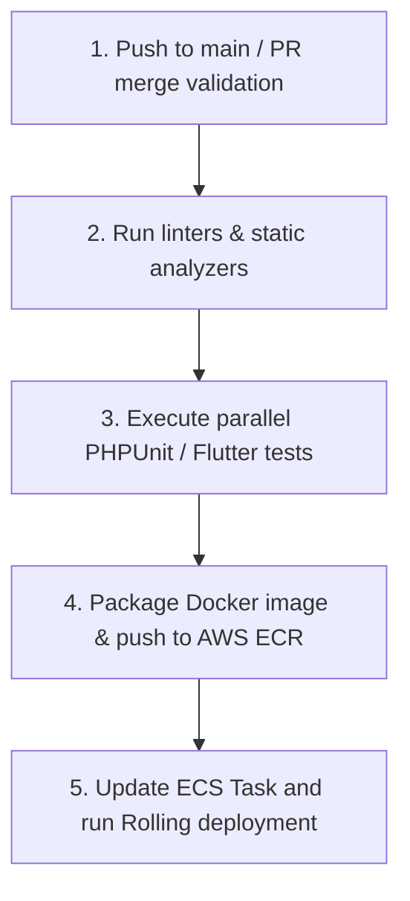

# BuildVault — Comprehensive CTO Implementation Roadmap & 16-Week Delivery Plan

**Document ID:** BV-ROAD-09  
**Author:** Chief Technology Officer & Technical Program Manager  
**Date:** June 15, 2026  
**Status:** Approved for Executive Execution  
**Version:** 1.0.0  

---

This document designs a comprehensive, highly detailed **Technical Program Management (TPM) Roadmap** and **16-Week Development Plan** for the engineering and execution of **BuildVault**. This blueprint coordinates team roles, sprint cycles, branch operations, and production launches.

---

## 1. High-Level Delivery Milestones

```
[Month 1: Phase I - Foundation] ──► [Month 2: Phase II - Workflows] ──► [Month 3: Phase III - Field Eng] ──► [Month 4: Phase IV - Launch]
  • Multitenancy Core Postgres        • Approvals Engine Integration        • Native Web & Mobile Apps          • Dynamic Pentesting Iterations
  • Supabase Auth Synchronization    • Dynamic Sequential Sign-offs        • Edge-cropped Document Scanning    • Live Multi-Region Deployment
  • Multi-Tier S3 Storage Gateway    • Compliance Checklists Engine        • Offline Local Sync Store          • General Availability (GA) Run
```

| Milestone | Target Horizon | Core Delivery Criteria |
| :--- | :--- | :--- |
| **M1: Core Multi-Tenant Engine** | **Week 4** | Complete Postgres schema initialization with RLS; Supabase Auth integration; secure presigned AWS S3 upload pathways verified. |
| **M2: Workflows & Compliance Run**| **Week 8** | Sequential/concurrent approval state machine complete; hourly compliance daemon; in-app notification alerts operational. |
| **M3: Mobile App & Local Scanning**| **Week 12** | Flutter app baseline complete; local Isar database cache synchronization engine; Hough Transform perspective scanner integration. |
| **M4: Production Hardening & GA**  | **Week 16** | Infrastructure provisioning via Terraform; third-party penetration testing complete; multi-region deployment live; GA launch. |

---

## 2. Resource Allocation & Team Structure

To maintain clean task execution across concurrent development tracks, the engineering division is split into specialized pods:

```
[Engineering Leadership Council: CTO / Principal Architect / TPM]
          │
          ├───► [Backend API Pod: Senior Laravel Engineer + Database Architect]
          │       • Core Postgres DB schema, Laravel 12 API modules, queue optimization.
          │
          ├───► [Mobile Interface Pod: 2x Flutter Mobile Engineers]
          │       • Native scanning components, Isar database cache, Flutter UI pages.
          │
          └───► [Cloud Security & DevOps Pod: DevOps Engineer + Security Architect]
                  • Terraform configurations, CI/CD runners, penetration testing audits.
```

---

## 3. Product Development Branch Strategy (GitHub Flow)

BuildVault uses a strict **GitFlow branching structure** to ensure stability while enabling rapid feature validation:

```
[production] (Immutable release branch)
     ▲
     │ (Hotfixes / Direct Tested Version Releases)
[staging] (Stable Release Candidate staging pool)
     ▲
     │ (Feature Integration merges via Pull Requests)
[development] (Working active branch)
     ▲
     │ (Dynamic branch out for individual tasks)
[feature/tenant-scoping] [feature/fcm-notifications] [feature/mobile-scanner]
```

### Pull Request (PR) Requirements
*   **Approval Gates:** All PRs targetting `development` or `staging` require approval from at least 2 Senior Engineers.
*   **Static Code Analysis:** PHPStan must score 0 errors at Level 6 or higher. Flutter analysis must report no styling or safety warnings.
*   **Automated Testing:** PHPUnit test coverage must exceed 85%. Integration testing suites must pass successfully.

---

## 4. CI/CD Delivery Pipelines

BuildVault maintains isolated staging and production environments powered by **GitHub Actions** and AWS pipelines.



---

## 5. 16-Week Scrum Release Plan

### Phase I: Foundation & Core Tenant Architecture (Weeks 1 - 4)

#### Sprint 1: Tenant Partitioning & Database Core (Weeks 1 - 2)
*   **Deliverables:**
    *   Deploy target PostgreSQL schema, configuring tenant-isolation tables and RLS constraints.
    *   Initialize Laravel 12 project framework, setting up domain model layers.
    *   Implement global `HasTenantScope` Eloquent trait to enforce automated logical user partition security blocks.
    *   *System Check:* Perform basic Postgres connection verification; validate mock tenant isolation structures.

#### Sprint 2: Federated Auth & S3 Secure Storage (Weeks 3 - 4)
*   **Deliverables:**
    *   Configure Supabase Auth credentials; implement JWT Verification Middleware in Laravel backend.
    *   Configure AWS KMS Customer Managed Keys (CMK); verify envelope encryption algorithms.
    *   Establish S3 Storage Gateway service provider in Laravel, returning PUT presigned URLs.
    *   *System Check:* Confirm safe API authentication with token verification; test S3 document uploads.

---

### Phase II: Structural Workflows & Compliance Engine (Weeks 5 - 8)

#### Sprint 3: Approvals State Machine & Comments (Weeks 5 - 6)
*   **Deliverables:**
    *   Build structural approval pipeline database schemas (`approvals`, `approval_sign_offs`).
    *   Implement sequential and concurrent review workflow controllers with state tracking.
    *   Develop threaded comment channels attached to approval pipelines.
    *   *System Check:* Validate state changes across document reviews; verify comment threads.

#### Sprint 4: Compliance Checklists & Notifications (Weeks 7 - 8)
*   **Deliverables:**
    *   Create compliance checklist databases tracker with automated expiration buffers.
    *   Develop Laravel scheduled daemon command scanning active permits for warnings.
    *   Configure Laravel Horizon backed by Redis; establish multi-channel notification engine (in-app + email).
    *   *System Check:* Trigger compliance alerts via CLI daemon; check queue management.

---

### Phase III: Mobile Field Interface & Offline Sync (Weeks 9 - 12)

#### Sprint 5: Flutter App Baseline & Offline Store (Weeks 9 - 10)
*   **Deliverables:**
    *   Initialize Feature-Driven Flutter project with BLoC and GoRouter navigation settings.
    *   Implement secure offline caching utilizing local Isar Database schema templates.
    *   Develop API connection clients configured with custom Dio interceptors for auth token management.
    *   *System Check:* Confirm login validation from mobile device; test offline storage read/write.

#### Sprint 6: Native Mobile Camera Document Scanner (Weeks 11 - 12)
*   **Deliverables:**
    *   Develop custom mobile camera capture interface with Hough-transform edge detection boundaries.
    *   Build image processing filters (Bilinear skew crop, Contrast enhancement scale, Black-and-White filters).
    *   Integrate direct client-to-S3 multi-part background stream uploading.
    *   *System Check:* Perform raw blueprints camera scan over device; inspect clean S3 PDF object output.

---

### Phase IV: Production Hardening, Audit Trails & Launch (Weeks 13 - 16)

#### Sprint 7: Integrated Security Audits & Admin Console (Weeks 13 - 14)
*   **Deliverables:**
    *   Implement global SHA-256 blockchain database audit trail ledger for tenant actions.
    *   Build SaaS Admin console for global operator oversight, excluding lookups of client records.
    *   Deploy third-party REST API integrations (WhatsApp Business API, eSign / Aadhaar portals).
    *   *System Check:* Verify audit ledger integrity checks; test third-party integrations.

#### Sprint 8: Cloud Provisioning, Penetration Testing & GA (Weeks 15 - 16)
*   **Deliverables:**
    *   Provision AWS resources using Terraform configuration templates.
    *   Conduct OWASP web and mobile app penetration testing; implement security fixes.
    *   Execute multi-channel mock load tests modeling production peaks.
    *   *System Check:* Transition Route 53 weights; launch platform for General Availability (GA).

---

## 6. AI-Assisted Modern Development Workflow

To accelerate development speed while maintaining code quality, BuildVault mandates the use of AI coding assistants (such as Google’s AI Coding Agent and Gemini models) across our engineering workflows:

### 6.1 AI Agent Prompting Rules
*   **Context Injection:** Developers must provide the system with the structural database schema (`03-Database-Schema.md`) and API specifications (`05-API-Specification.md`) before requesting backend code.
*   **Immutable Safety Constraint:** AI prompts must explicitly declare that logical tenant scope checks should never be placed in client code but instead remain hardcoded as server-side layers.

### 6.2 Collaborative Code Generation Loop
```
[Build Vault Engineer: Writes prompt detailing task constraints]
                     │
                     ▼
[AI Coding Agent: Generates clean codebase compliant with Laravel/Flutter design guidelines]
                     │
                     ▼
[Local Unit Testing: Continuous local compilation and linting suite runs]
                     │
                     ├───────► IF compile/lint fails: Paste error stack trace back into AI loop for correction
                     │
                     ▼
[Senior Code Review: Merges into core branch once code is validated]
```

### 6.3 Standard Verification Checks
*   **Laravel Backend:** Engineers must execute `php artisan test` and `./vendor/bin/phpstan` on local workspaces before initiating git push operations.
*   **Flutter Frontend:** Engineers must run `flutter test` and `flutter lint` on local environments before submitting pull requests. This prevents build failures on CI/CD runner workflows.
