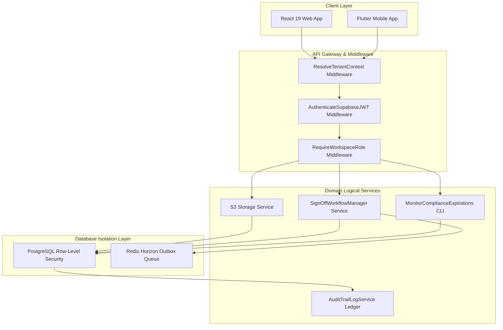
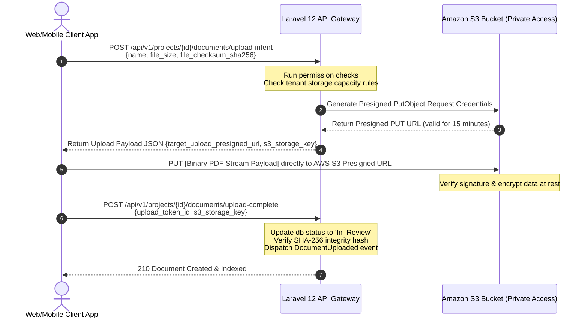

# BuildVault — Complete Technical Implementation & Engineering Execution Plan

**Document ID:** BV-EXEC-10  
**Author:** Chief Technology Officer & Staff Software Engineer  
**Date:** June 15, 2026  
**Status:** Approved for Core Engineering Kickoff  
**Version:** 1.0.0  

---

This document represents the absolute, comprehensive **Engineering Execution Plan** for BuildVault. It synthesizes the system architecture, database schema, permission matrix, API specification, framework selections, and cloud topologies into a single unified implementation strategy.

---

## 1. Development Roadmap (16-Week Phase Plan)

The development schedule is partitioned into four major phases, targetting high-value, testable milestones. 

```
┌────────────────────────────────────────────────────────────────────────┐
│ W1-W4: Phase I - Infrastructure Foundation & Core Multi-Tenancy         │
├────────────────────────────────────────────────────────────────────────┤
│ W5-W8: Phase II - Heavy Business Workflows & Compliance Core           │
├────────────────────────────────────────────────────────────────────────┤
│ W9-W12: Phase III - Multi-Device Client Layer (React Web & Flutter)    │
├────────────────────────────────────────────────────────────────────────┤
│ W13-W16: Phase IV - Security Hardening, Integrations & Production Run  │
└────────────────────────────────────────────────────────────────────────┘
```

*   **Phase I: Foundation & Core Multi-Tenancy (Weeks 1 – 4)**
    *   Initialize Laravel 12 multi-tenant core framework with strict database scoping.
    *   Deploy PostgreSQL v16 schema with Row Level Security (RLS) policies.
    *   Integrate Supabase Auth and construct dynamic JWT Verification Middlewares.
    *   Configure secure AWS KMS-backed envelope encryption systems.
*   **Phase II: Workflows & Compliance Core (Weeks 5 – 8)**
    *   Build structural approval pipeline state machine engines with threaded commenting.
    *   Develop regulatory compliance checklist models and daily scanning daemon processes.
    *   Set up Redis-driven Laravel Horizon worker queues and asynchronous dispatch pipelines.
*   **Phase III: Client Applications (Weeks 9 – 12)**
    *   Develop React 19 web application utilizing TanStack Router, TanStack Query, and Tailwind.
    *   Construct Feature-Feature Flutter Mobile App with local Isar DB database caches.
    *   Integrate Hough-transform perspective document scanning nodes natively inside Dart.
*   **Phase IV: Security Hardening, Integrations & Launch (Weeks 13 – 16)**
    *   Build the tamper-proof SHA-256 blockchain database audit trail logging ledger.
    *   Deploy target third-party integrations (WhatsApp Alerts, eSign / DigiLocker interfaces).
    *   Conduct comprehensive web, mobile, and API security penetration testing.
    *   Provision AWS resources using Terraform IaC templates and execute the live GA roll-out.

---

## 2. Module Dependency Map

The visual hierarchy below details the strict architectural dependency constraints of the BuildVault product. High-level client modules rest atop secure, decoupled service layers, interacting with transactional resources solely via scoped database engines.



---

## 3. Frontend Architecture

BuildVault implements a decoupled frontend approach to support desktop administrative tasks (React) and mobile site-level operations (Flutter) concurrently.

### 3.1 Web Application: React 19 & TanStack
*   **Framework Baseline:** React 19 SPA powered by Vite for rapid development.
*   **Routing & State:** **TanStack Router** manages state pathways in the URL. **TanStack Query (v5)** is utilized for optimistic cache mutations, data fetching, auto-retries, and state caching.
*   **Visual Interface:** Tailwind CSS utility library styled with a clean typography hierarchy pairing **Inter** (sans-serif) with monospace structural markers.
*   **Role Limitations:** Hidden tabs or toggles based on local role assessments. State verification is strictly validated server-side.

### 3.2 Mobile Application: Feature-Driven Flutter
*   **State Management:** Strict **BLoC (Business Logic Component)** patterns manage clean event-to-state representations asynchronously.
*   **Offline Capability:** Reads and writes target an embedded, high-performance transactional **Isar Local Database**. Writes save to a local sync cache, synchronizing with the server when connectivity is restored.
*   **Camera Document Scanner:** Captures images using low-level camera components. Integrates edge detection (Hough transform) to correct perspective skew, and applies black-and-white filters (300 DPI target format) to compile documents into clear, multi-page PDFs.

---

## 4. Backend Architecture

BuildVault’s server-side engine uses **Laravel 12** paired with PHP 8.3+, structured around Domain-Driven Design (DDD) to keep the codebase highly maintainable.

*   **SaaS Multi-Tenancy Strategy:** We use a **Logical Tenant Isolation Pattern** within a single database instance. Tables represent tenant-scoped resources and include an indexed `organization_id` column. A global model trait, `HasTenantScope`, automatically applies tenancy checks to prevent data leaks.
*   **Asynchronous Processing:** Heavy tasks—such as processing compliance expirations, checking uploaded PDF checksums, and dispatching WhatsApp alerts—are handled by background processes using **Laravel Horizon** and Redis queues.
*   **Integration Services:** Sensitive client files, DigiLocker credentials, and eSign API keys are encrypted before storage and decrypted on the fly using Laravel's encryption engine with `AES-256-GCM` key wrapping, backed by unique keys stored in HSM (Hardware Security Module).

---

## 5. API Architecture

API endpoints follow strict REST conventions, routing operations through multiple security wrappers before execution.

```
       [GET /api/v1/projects]
                 │
                 ▼
    [Subdomain Parsing Context]  ◄─── ResolveTenantContext Middleware
                 │
                 ▼
     [Decrypt Token Signature]  ◄─── AuthenticateSupabaseJWT Middleware
                 │
                 ▼
    [Evaluate Permissions Scope]◄─── RequireWorkspaceRole Middleware
                 │
                 ▼
          [Execute Query]
```

*   **Gateway Rate Limiting:** Managed using Redis token bucket filters configured in Laravel's routing middleware. High-frequency API endpoints limit requests to 60 per minute to prevent system abuse.
*   **Content-Type Enforcement:** The gateway rejects connections that lack standard `Accept: application/json` and `Content-Type: application/json` headers with a `406 Not Acceptable` error code.
*   **Response Cache System:** Safe read requests (e.g., project directory listings, workspace summaries) are cached in Redis cache structures. Caches are invalidated instantly when create or update actions are triggered.

---

## 6. Database Migration Sequence

To prevent schema integrity issues and foreign key violations, database migrations must execute in this exact sequence:

1.  **System Extensions & Enums:** Enable global utilities (`uuid-ossp`, `pgcrypto`) and define custom ENUM types (`tenant_status`, `user_status`, `project_status`, `document_status`, `approval_priority`, `approval_status`, `compliance_status`).
2.  **`organizations`:** The core tenant partition entity.
3.  **`users`:** Identity index linking back to organizations.
4.  **`projects`:** Core operational pipeline workspaces.
5.  **`user_roles`:** Core RBAC mappings linking users, roles, and projects.
6.  **`documents` & `document_versions`:** Store file metadata, versions, and security metadata hashes.
7.  **`approvals` & `approval_sign_offs`:** Orchestrate multi-tier, sequential document reviews.
8.  **`approval_comments`:** Support threaded, contextual reviewer feedback in the pipeline.
9.  **`compliance_checklists`:** Track regulatory permit tasks, deadlines, and alerts.
10. **`notifications`:** Maintain a central system-wide alert ledger.
11. **`integrations`:** Store encrypted credentials for third-party tools.
12. **`audit_logs`:** Capture audit records using a secure SHA-256 chain.

---

## 7. Authentication Implementation Plan

Identity management is decoupled from Laravel, utilizing a hybrid approach combining **Supabase Auth** with local, role-based records.

```
[Web/Mobile Interface]   ──(1. Login)──► [Supabase Auth Node] ──(2. Ret JWT Key)──► [Web/Mobile Interface]
          │                                                                                   │
          └─────────────────────(3. API Call Bearer JWT)──────────────────────────────────────┘
                                                                                              ▼
[Laravel API Gateway]  ◄──(5. Read user_roles)── [PostgreSQL Database] ◄──(4. Decode & Match Keys)
```

1.  **Identity Verification:** The user logs in via the UI, exchanging credentials with Supabase Auth to receive a signed, RS256-encrypted JSON Web Token (JWT).
2.  **Signature Verification:** During every API request, the Laravel gateway intercepts the token and verifies its signature against the Supabase JWKS endpoint.
3.  **Identity Mapping:** The email address from the decoded JWT payload is mapped to the tenant's user profile database record.
4.  **Workspace Isolation:** The active database connection loads the verified organizational context, setting a local path mapping session query variable to lock subsequent queries to that organization.
5.  **RBAC Verification:** The system checks user role mappings inside `user_roles` to verify permissions before granting access.

---

## 8. S3 Upload Implementation Plan

To handle large engineering drawings and architectural plans reliably, client devices upload files directly to S3 using private, temporary presigned URLs, bypassing the Laravel web servers.



---

## 9. Deployment Plan

Uptime and security are optimized using automated, infrastructure-as-code deployment pipelines.

```
[Route 53 Routing Gate] ──► [WAF Block Rules] ──► [CloudFront CDN Edge Cache] ──► [Load Balancer]
                                                                                          │
                        ┌─────────────────────────────────────────────────────────────────┘
                        ▼
       [Private Multi-AZ AWS ECS Fargate Cluster]
         ├── Container Instance: Laravel API Node (Autoscaled)
         └── Container Instance: Horizon Workers Queue (Autoscaled)
                        │
                        ▼
       [Private Isolated Database & Storage Tiers]
         ├── AWS Aurora Serverless v2 PostgreSQL (Primary & Replica)
         ├── Amazon ElastiCache for Redis Cluster (Queue & Cache Database)
         └── AWS S3 Protected Document Bucket
```

*   **Infrastructure Management:** AWS resources are provisioned cleanly using reproducible configuration templates with **Terraform IaC**.
*   **Scale-Out Rules:** ECS containers auto-scale dynamically. New container tasks launch if the average CPU exceeds 70% or memory utilization climbs past 75% for 3 consecutive minutes.
*   **CI/CD Pipeline Sequence:** GitHub Actions handle automated deployment on branch updates:
    ```
    Push to main branch -> Run phpstan & analytical linting -> Run unit test suites -> Build Docker Image -> Push to AWS ECR -> Deploy rolling updates to ECS Tasks
    ```

---

## 10. Milestone Deliverables Plan

The table below defines the clear development schedule for BuildVault, mapping activities to weekly deliverables with clear verification tests.

| Phase | Target Timeline | Deliverable Actions | Verification Checks |
| :--- | :--- | :--- | :--- |
| **Phase I** | **Week 1** | PostgreSQL schema deployment with Row-Level Security configurations. | Test cross-tenant data operations; verify logical isolation boundaries. |
| | **Week 2** | Laravel 12 workspace project initialization and core routing setups. | Run initial route tests; verify base configuration files. |
| | **Week 3** | Supabase Auth API gateway integration with custom validation middleware. | Authenticate sandbox sessions; verify JWT verification. |
| | **Week 4** | AWS S3 storage gateway implementation with KMS-backed encryption. | Test direct S3 file uploads using presigned URLs. |
| **Phase II**| **Week 5** | Doc workflow database layouts and basic approval controllers. | Test state changes across document review stages. |
| | **Week 6** | Sequential and concurrent approval state engine pipelines. | Verify document signing sequences and workflow states. |
| | **Week 7** | Regulatory compliance database models and deadline monitors. | Verify automated completion states on file upload. |
| | **Week 8** | Redis and Laravel Horizon worker queue setup for alerts. | Test email and in-app notifications in background queues. |
| **Phase III**|**Week 9** | React 19 web baseline integration and TanStack Query setup. | Navigate routes dynamically; test optimistic state changes. |
| | **Week 10** | Flutter Mobile feature setup and local Isar DB offline caches. | Verify user login flows; test offline data writes. |
| | **Week 11** | Camera controller, cropping, and contrast cleaning pipelines. | Perform perspective skewed capture; compile scanned output. |
| | **Week 12** | Direct client-to-S3 multi-part background upload. | Confirm background uploads with network state updates. |
| **Phase IV**| **Week 13** | Immutable audit trail ledgers with SHA-256 chain links. | Verify audit trail log consistency on file changes. |
| | **Week 14** | Client portal integrations (eSign, Aadhaar, SMS / WhatsApp). | Test third-party API webhook endpoints. |
| | **Week 15** | Terraform infrastructure provisioning on AWS cloud. | Confirm multi-AZ load balancer routing and failover states. |
| | **Week 16** | Comprehensive security penetration and load testing. | Verify OWASP vulnerability mitigation; launch GA release. |
